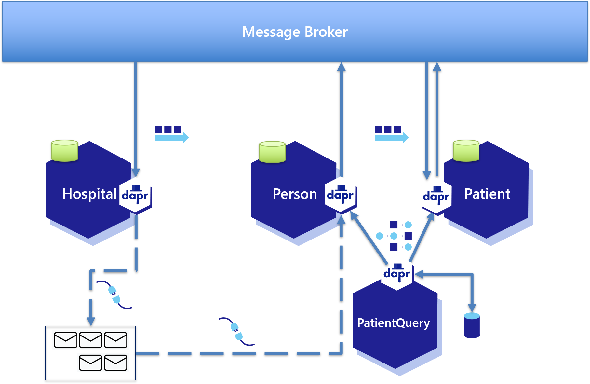

# The Dapr Hospital workshop

In order to take the most out of this workshop, you should be familiar with .NET and the C# programming language.  Though no previous experience with microservices is assumed, you should be familiar with building and deploying server-based applications.

## Scenario
In this series of labs, you will implement Dapr and some of its building blocks on DaprHospital: a fictitious hospital system that includes the following microservices:
- Person
- Patient
- PatientQuery
- Hospital

The following diagram shows the entire DaprHospital solution:

## Microservices
DaprHospital includes four microservices: Person, Patient, PatientQuery, and Hospital.

### Person
The Person microservice is meant to manage the basic information about people.

### Patient
The Patient microservice manages the clinical information about patients.  There is a 1:1 relationship between people and patients.

### PatientQuery
The PatientQuery is used to obtain and merge data from both the Person and Patient microservices.

### Hospital
The Hospital microservice manages the Inpatient information, such as procedures applied.

## Building blocks
Dapr includes a number of building blocks to easily create distributed applications and to help abstract away the complexities of these kinds of architectures.  In DaprHospital, you will implement the following building blocks:

- Pub/Sub
- Service-to-service invocation
- State management
- Input and Output bindings

In addition, you will deploy DaprHospital in an Azure Kubernetes Service (AKS) cluster.

## Software prerequisites
- Windows 10 2004 or above
- Visual Studio 2022 17.0 or above
- Visual Studio Code 1.66 or above
- .NET 6.0 SDK
- Docker Desktop for Windows 20.10.11 or above
- Local SQL Server engine (SQL Server or SQL Server Express)
- SQL Server Management Studio or Azure Data Studio
- Windows Terminal or PowerShell
- Git 2.33 or above
- Postman
- Azure CLI 2.28 or above
- Helm 3.6.3 or above
- An Azure account (You can get a free trial on [azure.com/free](https://azure.com/free))
- A Docker Hub account (https://hub.docker.com)