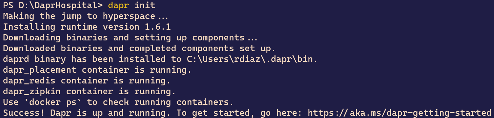

# Lab 1 - Setting up the development environment

In this lab, you will set up your development environment for use in the rest of the labs of this workshop.
 
Duration: 20 minutes

## Task 1: Install Dapr
1. Open the Windows Terminal with administrative rights and execute the following command:

    ```powershell
    powershell -Command "iwr -useb https://raw.githubusercontent.com/dapr/cli/master/install/install.ps1 | iex"
    ```

2. Verify the installation by executing `dapr --version`

## Task 2: Initialize Dapr
1. Ensure that Docker is up and running.  Otherwise, you will receive the following error:

    >     Making the jump to hyperspace... could not connect to Docker. Docker may not be installed or running

2. Execute the following command:

    `dapr init`
    
3. Dapr will start downloading the default Docker images for the Pub/Sub, State, and Observability building blocks.  Those Docker containers will be used as sidecar for your own microservices.


4. Once finished, inspect your `$HOME\.dapr` folder

## Task 3: Clone the repo
1. Execute the following command to clone the repo:

    `git clone https://github.com/rdiazconcha/kcdc2021-dapr-workshop.git`

## Task 4: Inspect the code
1. Execute `git branch --all` and observe the different branches.  Each branch corresponds to a particular lab state (start/end).

2. Checkout the **lab1_start** branch by running the following command:
`git checkout lab1_start`

3. Open the DaprHospital solution in Visual Studio.

4. Inspect the solution structure.  The solution consists of the following six projects:

    | Project           | Description                     |
    |-------------------|---------------------------------|
    | DaprHospital.Core | Shared kernel for domain models |
    | DaprHospital.IntegrationEvents | Integration events for pub/sub |
    | DaprHospital.Person.Api | Person microservice |
    | DaprHospital.Patient.Api | Patient microservice |
    | DaprHospital.PatientQuery.Api | Patient query microservice |
    | DaprHospital.Hospital.Api | Hospital microservice |

5. Build the solution to restore the NuGet packages and ensure that it compiles without issues.a

## Task 5: Set the connection strings
1. Add a connection string in the appsettings.json files of the Person, Patient, and Hospital microservices.  The connection string name should be the short name of its respective microservice.  The following code snippet shows the connection string for the Person microservice, as used in a local SQL Server express instance:

    ```json
    "ConnectionStrings": {
      "Person": "Data Source=localhost\\sqlexpress;Initial Catalog=Person;Integrated Security=true;"
    }
    ```

## Task 6: Run with Dapr CLI
1. Execute each of following commands in a separate tab of the Windows Terminal, to run each microservice and use Dapr as a sidecar.  Note the `--app-id`, `--app-port`, and `--dapr-http-port` parameter values.

    `dapr run --app-id person --app-port 5000 --dapr-http-port 50000 -- dotnet run -p .\DaprHospital.Person.Api\`
    
    `dapr run --app-id patient --app-port 5001 --dapr-http-port 50001 -- dotnet run -p .\DaprHospital.Patient.Api\ --urls http://localhost:5001`
    
    `dapr run --app-id hospital --app-port 5002 --dapr-http-port 50002 -- dotnet run -p .\DaprHospital.Hospital.Api\ --urls http://localhost:5002`
    
2. In a fourth tab, execute the following command to run the Dapr dashboard:

    `dapr dashboard`
    
3. Navigate to the dashboard by Ctrl-clicking the address in the Windows Terminal, or manually open a browser and navigate to **http://localhost:8080**

4. Inspect the Dapr dashboard UI and its options.

5. Verify that the three microservices' databases were created, by using SQL Server Management Studio or Azure Data Studio.

## Task 7: Install Tye
1. Execute the following command:

    `dotnet tool install --global Microsoft.Tye --version 0.9.0-alpha.21380.1`
    
2. Verify by executing the following command:

    `dotnet tool list`

## Task 8: Run with Tye
Tye allows you to run a microservices solution easily.  With its Dapr integration, you can quickly run all the microservices and their Dapr sidecars.

1. Execute the following command in the folder where the .sln file is located:

    `tye init`

2. Open the `tye.yaml` file with a code editor such as Visual Studio Code or Notepad.  Modify the microservices names and add the dapr extension, in the extensions element under the application name.  The following image shows the applied changes:

    

3. Execute the following command:

    `tye run`
4. You should see something similar to the following image:

    
    
5. On the top of the output, you should see a "Dashboard running on http://127.0.0.1:2447" message.  You can Ctrl-click on it to open the dashboard in the browser.

6. Inspect the Dapr dashboard
